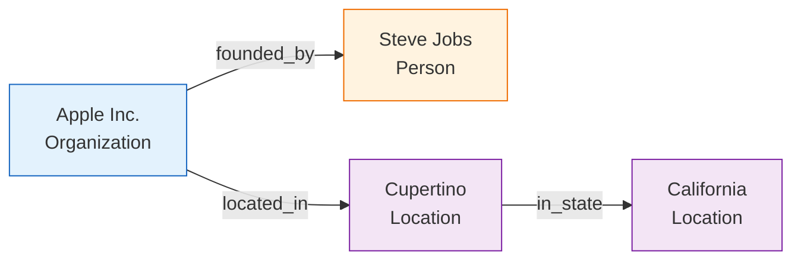
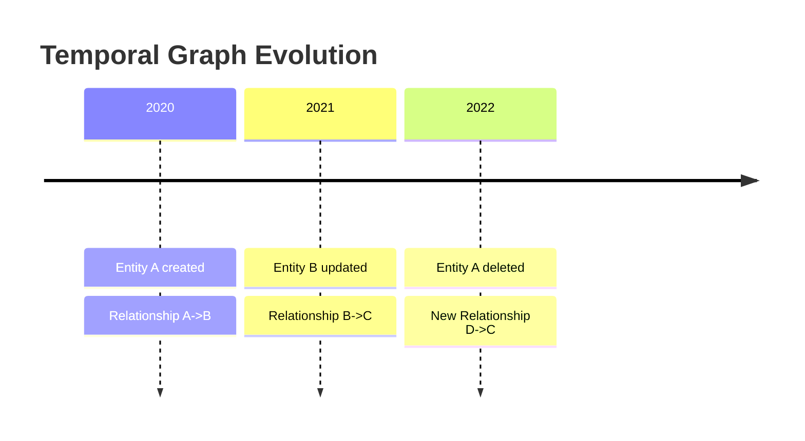
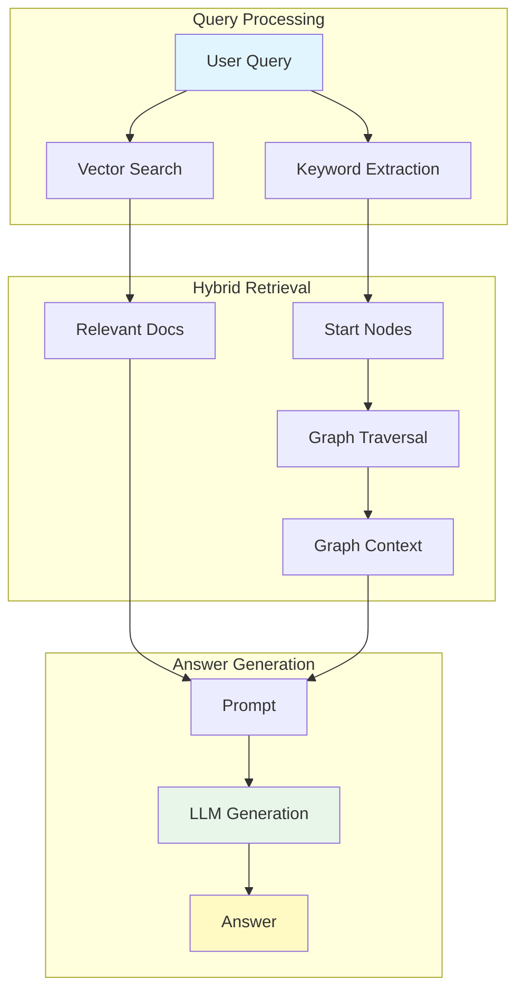

# Core Concepts

Understand the fundamental concepts behind Semantica. This guide covers the theoretical foundations, key components, and best practices for building semantic applications.

## 🧠 Core Concepts

### 1. Knowledge Graphs

**Definition**: A knowledge graph is a structured representation of entities (nodes) and their relationships (edges) with properties and attributes.

- **Nodes**: Represent entities (people, places, concepts, events)
- **Edges**: Represent relationships (works_for, located_in, causes)
- **Properties**: Attributes of entities and relationships
- **Metadata**: Additional information (sources, timestamps, confidence)

??? info "Deep Dive: Graph Theory Basics"
    At its core, a knowledge graph is a directed multigraph $G = (V, E)$ where:
    - $V$ is a set of vertices (entities)
    - $E$ is a set of edges (relationships)
    - Edges are directed: $(u, v) \in E$ implies a relationship from $u$ to $v$.
    - Multigraph property allows multiple edges between the same pair of vertices (e.g., "Friend" and "Colleague").

**Benefits**:
- Structured representation of unstructured data
- Enables complex queries and reasoning
- Supports temporal tracking
- Facilitates knowledge discovery



### 2. Entity Extraction (NER)

**Definition**: The process of identifying and classifying named entities in text into predefined categories.

| Entity Type | Description | Example |
| :--- | :--- | :--- |
| **Person** | Names of people | Steve Jobs, Elon Musk |
| **Organization** | Companies, institutions | Apple Inc., NASA |
| **Location** | Places, geographic entities | Cupertino, Mars |
| **Date/Time** | Temporal expressions | 1976, next Monday |
| **Money** | Monetary values | $100 million |
| **Event** | Events and occurrences | WWDC 2024 |

!!! tip "Custom Entities"
    Semantica allows you to define custom entity types via the `Ontology` module. You aren't limited to the standard set!

**Methods**:
- **Rule-based**: Pattern matching (Regex)
- **Machine Learning**: Trained models (spaCy, transformers)
- **LLM-based**: Using large language models (GPT-4, Claude)

### 3. Relationship Extraction

**Definition**: Identifying and extracting relationships between entities in text.

=== "Semantic"
    Relationships that define meaning and connection.
    - `works_for`
    - `located_in`
    - `founded_by`

=== "Temporal"
    Relationships defined by time.
    - `happened_before`
    - `happened_after`
    - `during`

=== "Causal"
    Cause and effect relationships.
    - `causes`
    - `results_in`
    - `prevents`

### 4. Embeddings

**Definition**: Dense vector representations of text, images, or other data that capture semantic meaning in a continuous vector space.

> [!NOTE]
> Embeddings are the bridge between human language and machine understanding.

**Example**:
```python
Text: "machine learning"
Embedding: [0.123, -0.456, 0.789, ..., 0.234] 
# (vector of 1536 dimensions)
```

### 5. Temporal Graphs

**Definition**: Knowledge graphs that track changes over time, allowing queries about the state of the graph at specific time points.



### 6. GraphRAG

**Definition**: An advanced RAG (Retrieval Augmented Generation) approach that combines vector search with knowledge graph traversal to provide more accurate and contextually relevant information to LLMs.

**Advantages over Traditional RAG**:
- Better handling of complex queries
- Relationship-aware retrieval
- Reduced hallucinations
- More accurate answers



### 7. Ontology

**Definition**: A formal specification of concepts, relationships, and constraints in a domain, typically expressed in OWL (Web Ontology Language).

- **Classes**: Categories of entities (e.g., `Person`, `Company`)
- **Properties**: Relationships and attributes (e.g., `worksFor`)
- **Individuals**: Specific instances (e.g., `John Doe`)
- **Axioms**: Rules and constraints

### 8. Quality Assurance

**Definition**: Processes and metrics to ensure knowledge graph quality.

- **Completeness**: Percentage of entities with required properties
- **Consistency**: Absence of contradictions
- **Accuracy**: Correctness of extracted information
- **Coverage**: Breadth of domain coverage

---

## 🌟 Best Practices

Following these practices will help you build high-quality knowledge graphs and avoid common pitfalls.

### 1. Start Small
!!! tip "Iterative Approach"
    Don't try to model the entire world at once. Start with a small, well-defined domain and expand incrementally.

### 2. Configure Properly
- Use environment variables for sensitive data.
- Set up proper logging.
- Configure appropriate model sizes.

### 3. Validate Data
!!! warning "Garbage In, Garbage Out"
    Always validate extracted entities. A knowledge graph with incorrect facts is worse than no graph at all.

### 4. Handle Errors
- Implement error handling.
- Use retry mechanisms.
- Log errors for debugging.

### 5. Optimize Performance
- Use batch processing for large datasets.
- Enable parallel processing where possible.
- Cache embeddings and results.

### 6. Document Workflows
- Document data sources.
- Track processing steps.
- Maintain metadata.

---

## 🔧 Troubleshooting

Common issues and solutions:

!!! failure "Import Errors"
    **Solution**:
    - Ensure Semantica is properly installed.
    - Check Python version (3.8+).
    - Verify virtual environment is activated.
    - Install missing dependencies: `pip install -r requirements.txt`

!!! failure "API Key Errors"
    **Solution**:
    - Set environment variables: `export SEMANTICA_API_KEY=your_key`
    - Check config file for correct key format.
    - Verify API key is valid and has sufficient credits.

!!! failure "Memory Issues"
    **Solution**:
    - Process documents in batches.
    - Use smaller embedding models.
    - Enable garbage collection.
    - Consider using streaming for large datasets.

!!! failure "Low Quality Extractions"
    **Solution**:
    - Preprocess and normalize text.
    - Use domain-specific models.
    - Adjust extraction parameters.
    - Validate and clean extracted entities.

!!! failure "Slow Processing"
    **Solution**:
    - Enable parallel processing.
    - Use GPU acceleration if available.
    - Cache intermediate results.
    - Optimize batch sizes.
